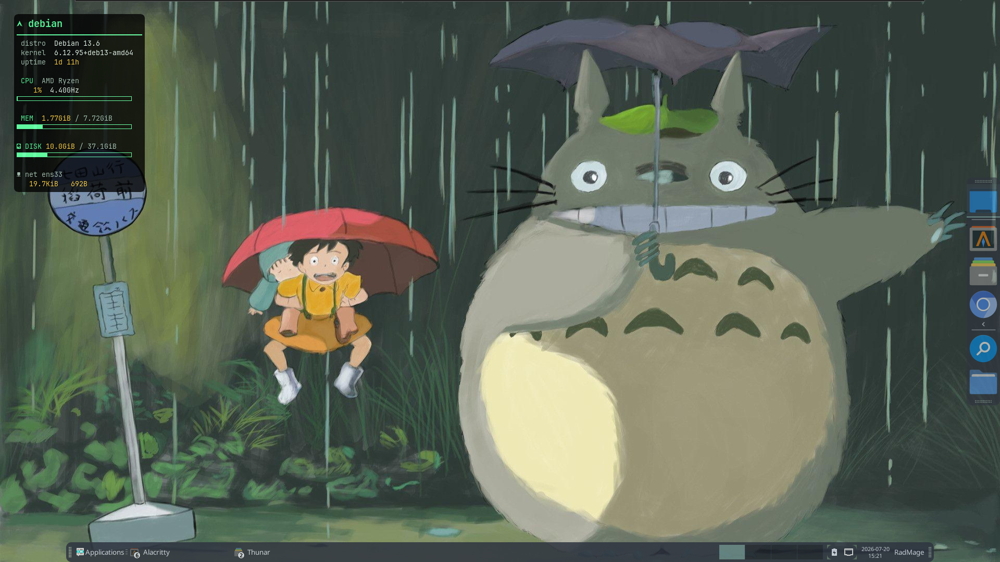
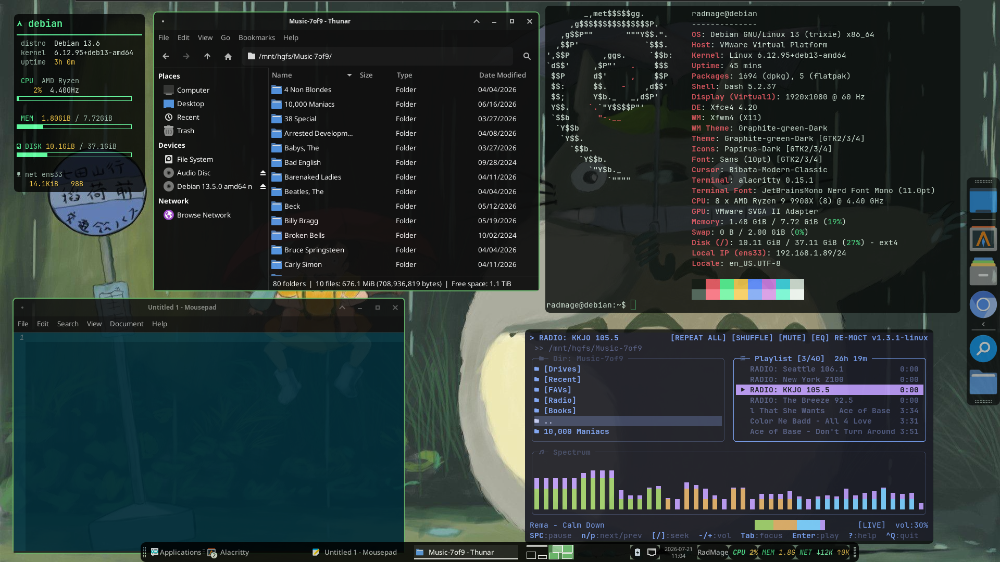

# debianvm — Xfce Rice

My Debian 13 (Trixie) smoke-test box, riced on Xfce / Xfwm4. Dark-and-green
chrome with a phosphor-green terminal identity, over a *My Neighbor Totoro*
wallpaper. Every layer — chrome, terminals, conky, and panel — shares one
dark-green palette.

## The Stack

| Component      | Choice                                   |
|----------------|------------------------------------------|
| Distro         | Debian 13 (Trixie)                       |
| DE / WM        | Xfce 4.20 / Xfwm4 (X11)                  |
| Compositor     | picom (xrender backend)                  |
| GTK + WM theme | [Graphite-green-Dark](https://github.com/vinceliuice/Graphite-gtk-theme) |
| Icons          | Papirus-Dark                             |
| Cursor         | Bibata-Modern-Classic                    |
| Terminal       | Alacritty ("Phosphor" scheme)            |
| Font           | JetBrainsMono Nerd Font Mono             |
| System monitor | conky (custom, phosphor palette)         |
| Panel readouts | xfce4-panel + genmon (custom scripts)    |

## What's in here

- \`picom.conf\` — compositor config -> \`~/.config/picom/\`
- \`conky.conf\` — system-monitor widget -> \`~/.config/conky/\`
- \`alacritty.toml\` — "Phosphor" green CRT scheme, TUI-safe ANSI -> \`~/.config/alacritty/\`
- \`panel-scripts/\` — genmon scripts (cpu / mem / net) for the panel -> \`~/.config/panel-scripts/\`

## Install

Themes, icons, cursor, fonts:

\`\`\`bash
# Graphite (green accent, dark, black background) — needs sassc to build
sudo apt install -y sassc
git clone --depth=1 https://github.com/vinceliuice/Graphite-gtk-theme /tmp/Graphite
cd /tmp/Graphite && ./install.sh -t green -c dark --tweaks black && cd -

# Icons + cursor + conky + genmon plugin (Debian repos)
sudo apt install -y papirus-icon-theme bibata-cursor-theme conky-all xfce4-genmon-plugin

# JetBrainsMono Nerd Font
mkdir -p ~/.local/share/fonts
curl -OL https://github.com/ryanoasis/nerd-fonts/releases/latest/download/JetBrainsMono.tar.xz
tar -xf JetBrainsMono.tar.xz -C ~/.local/share/fonts/
fc-cache -f
\`\`\`

Drop the configs into place:

\`\`\`bash
cp picom.conf     ~/.config/picom/
cp conky.conf     ~/.config/conky/
cp alacritty.toml ~/.config/alacritty/
mkdir -p ~/.config/panel-scripts
cp panel-scripts/*.sh ~/.config/panel-scripts/
chmod +x ~/.config/panel-scripts/*.sh
\`\`\`

Apply the themes via **Settings**:
- Appearance -> Style -> **Graphite-green-Dark**
- Window Manager -> Style -> **Graphite-green-Dark**
- Appearance -> Icons -> **Papirus-Dark**
- Mouse and Touchpad -> Theme -> **Bibata-Modern-Classic**

Add the panel readouts: right-click panel -> **Add New Items -> Generic Monitor**
(add three). In each one's Properties, set the Command to the **absolute** path
(\`/home/<user>/.config/panel-scripts/cpu.sh\`, \`mem.sh\`, \`net.sh\`), Period ~2s,
and uncheck "Display label".

Autostart picom and conky (Session and Startup -> Application Autostart).

## Notes

- **picom is on the \`xrender\` backend, not \`glx\`.** This is a VMware guest with
  soft-rendered 3D — glx fails to enable vsync and can freeze the display.
  xrender gives fades, transparency, and rounded corners with no GPU dependency.
  On real hardware, switch to \`backend = "glx"\` for smoother compositing + blur.
- **genmon needs absolute paths** (it doesn't expand \`~\`) and the scripts are
  **sleep-free** — they stash the previous reading in \`/tmp\` and diff against it,
  so they run instantly and can't hang the panel at any poll rate.
- **conky rounded corners** come from picom, not conky. The conky window type is
  set to \`normal\` (not \`desktop\`) so picom applies its corner radius; its
  background opacity is tuned to sit like the Alacritty glass.
- The Alacritty colors keep a green phosphor primary (bg/fg/cursor) but use
  conventional, high-contrast ANSI 8–15 so TUIs render their highlights correctly.
- conky uses Nerd Font glyphs — needs JetBrainsMono Nerd Font installed to render
  the icons instead of tofu boxes.

## Credits

- [Graphite-gtk-theme](https://github.com/vinceliuice/Graphite-gtk-theme) by vinceliuice
- [Nerd Fonts](https://github.com/ryanoasis/nerd-fonts) by ryanoasis
- Wallpaper: *My Neighbor Totoro* (Studio Ghibli)
